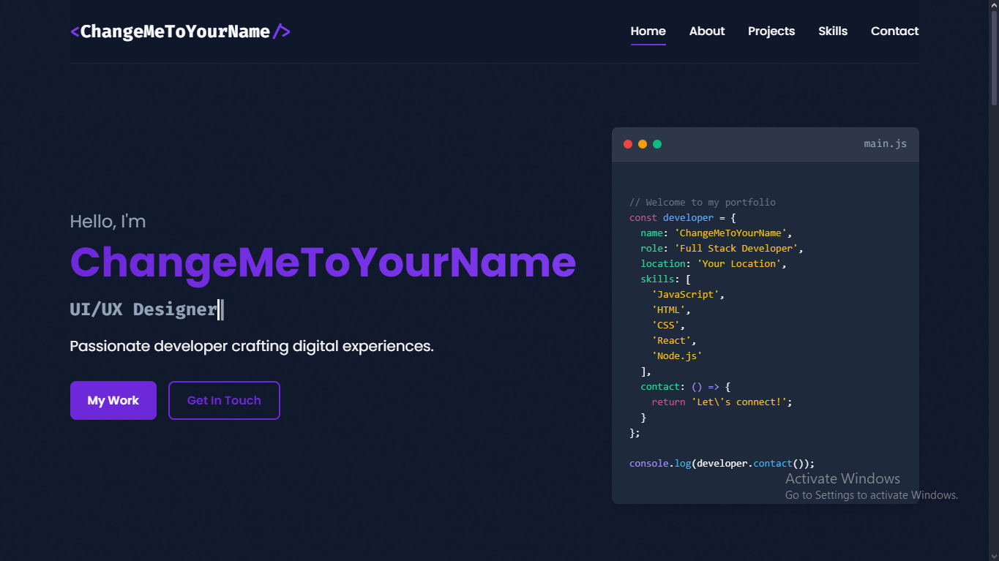

# Personal Portfolio Website

A sleek, modern, and responsive portfolio website with a dark theme to showcase your projects and skills.



## Features

- 🌙 Elegant dark theme with subtle animations
- 📱 Fully responsive design that looks great on all devices
- ⚡ Interactive elements with smooth transitions
- 💻 Clean and modern code structure
- 📊 Animated skill progress bars
- 📝 Functional contact form
- 🔄 Typewriter animation effect
- 🧠 Smart navigation highlighting based on scroll position

## Important Notice

**It is against my policy to remove or modify the following footer credit from the HTML:**

```html
<div class="footer-signature" id="footerSignature">Made By <a href="https://github.com/Goose-HonkCore" target="_blank">Goose</a></div>
```

This credit appears at line 370 in the HTML file and must remain intact. The JavaScript contains protective code to ensure this credit remains visible. Attempts to remove or hide this credit violate the terms of use for this template.

## File Structure

```
portfolio/
├── index.html         # Main HTML document
├── styles.css         # CSS styling
├── script.js          # JavaScript functionality
└── README.md          # Project documentation
```

## Getting Started

1. Clone this repository
2. Customize the content in `index.html` to make it your own
   - Replace "ChangeMeToYourName" with your actual name
   - Update project descriptions, skills, and contact information
   - Add your own photo and project images
3. Modify `styles.css` to match your personal branding if needed
4. Deploy to GitHub Pages or your preferred hosting service

## Customization Guide

### Changing the Color Scheme

Open `styles.css` and modify the following variables in the `:root` selector to create your own color palette:

```css
:root {
    --bg-primary: #0f172a;        /* Main background color */
    --bg-secondary: #1e293b;      /* Secondary background color */
    --text-primary: #f8fafc;      /* Primary text color */
    --text-secondary: #94a3b8;    /* Secondary text color */
    --accent-primary: #6d28d9;    /* Main accent color */
    --accent-secondary: #4c1d95;  /* Secondary accent color */
    --accent-highlight: #7c3aed;  /* Highlight accent color */
    /* ... other variables ... */
}
```

### Adding Projects

To add a new project to your portfolio, copy the project card structure in the HTML and customize it:

```html
<div class="project-card">
    <div class="project-image">
        
    </div>
    <div class="project-content">
        <h3>Project Name</h3>
        <p>Project description goes here...</p>
        <div class="project-tech">
            <span>Technology 1</span>
            <span>Technology 2</span>
            <span>Technology 3</span>
        </div>
        <div class="project-links">
            <a href="#" class="btn btn-sm"><i class="fas fa-globe"></i> Live Demo</a>
            <a href="#" class="btn btn-sm btn-outline"><i class="fab fa-github"></i> GitHub</a>
        </div>
    </div>
</div>
```

### Modifying Skills

Update your skills and proficiency levels by editing the skill items in the HTML:

```html
<div class="skill-item">
    <div class="skill-info">
        <span>Skill Name</span>
        <span>85%</span>
    </div>
    <div class="skill-bar">
        <div class="skill-progress" style="width: 85%;"></div>
    </div>
</div>
```

### Changing the Typewriter Text

Open `script.js` and update the `roles` array with your own titles:

```javascript
const roles = [
    "Full Stack Developer",
    "UI/UX Designer",
    "Problem Solver",
    "Your Custom Role",
    "Another Title"
];
```

## Footer Credit Protection

This portfolio template includes JavaScript code that:
- Automatically restores the footer credit if it's removed from the DOM
- Checks every minute to ensure the footer credit remains visible
- Prints a credit message to the console every minute
- Uses obfuscation techniques to make it difficult to disable these protections

**Note:** Attempting to remove the footer credit or disable the protection mechanisms is against the usage terms of this template.

## Browser Compatibility

- Chrome (latest)
- Firefox (latest)
- Safari (latest)
- Edge (latest)
- Opera (latest)

## License

This project is available for use with the following conditions:
1. The footer credit to Goose must remain intact and visible
2. The protective JavaScript code must not be disabled
3. All other aspects of the template may be customized freely

## Acknowledgments

- Font Awesome for the icons
- Google Fonts for the typography
- Template created by [Goose](https://github.com/Goose-HonkCore)

---

Made By [Goose](https://github.com/Goose-HonkCore) | © 2025 All Rights Reserved
